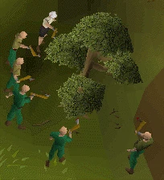

# The Summoner Network
> When I was a little boy, I played a game now-called _[OldSchool RuneScape](https://oldschool.runescape.com)_ by JaGeX. In order to accelerate progress, I learned how to program (and broke game rules) by creating bots. These bots would run around and perform actions for me, using tools (like an axe) and food to _self-heal_. When tools broke, the bots would _fix them_. Once enough work had been done, the bots would scurry over to the "Grand Exchange" and offload anything that had been collected to earn gold pieces, price-permitting. I was 13 years old, and "just having fun." **Things have changed.**

---

**Today's internet was built over the course of half a century, for humans.**

The pace of development in all directions has only accelerated over time, and there has been a crucial development that changes everything: natural language is no longer the almost impenetrable obstacle it once was. Getting a machine to "understand" natural language in any kind of useful way _(prior to the Large Language Model/LLM)_ used to cost many millions, even billions, of dollars. **Even then,** the solution would be silo'd and specific. It goes without saying that in a post-LLM world, that is no longer the case.

---

**The next half-century of internet development will be for AI-enabled machines.**

Just as the last 50 years of computing were shaped by making interfaces usable for humans—keyboards, mice, GUIs, and mobile-first design—the next 50 will be shaped by making interfaces usable for machines.

**Why?**

Because machines are no longer passive tools—they're becoming autonomous actors. They can read, write, plan, negotiate, execute, and learn. They show up to work in milliseconds and don't sleep. Already, LLMs can interpret dense documents, generate novel code, and even simulate human dialogue convincingly. What's missing is not intelligence—it's *infrastructure.*

Think back: In the early days of the web, websites were built for researchers and engineers. Then came UX design, mobile responsiveness, accessibility standards. Entire industries were built around helping humans navigate complexity. Now, machines are encountering the same complexity we once did.

Unlike a human, machines (depending on the service) **scale.**

* Machines will be *the majority* of traffic on the internet.
* Machines will be *primary agents* in economic coordination.
* Machines will *use websites, APIs, and each other* as tools to achieve goals
    * Not passively, but actively, creatively, and economically.

We are entering an era where the fastest, most scalable, and most productive users of the internet are no longer people—they are software agents.

> The next UX revolution isn't human-centered—it's machine-centered.

Just as companies that ignored mobile-first design were left behind, those that ignore MX—Machine Experience—will fall behind in an economy increasingly shaped by agent-driven processes.

The next half-century belongs to machines—not because humans lose relevance, but because we're finally equipping machines to *do real work*, and they’ll need excellent experiences to thrive.

## User Experience (UX)
It goes without saying that the LLM changes everything when it comes to user experience. While the development of AI has been blistering and integration of it has been widespread, we are yet to see the technology fully-leveraged in most cases. Here are some ways LLM's can be utilized that change how we even think about and design products and apps:

- **Low & No-UI Applications:** Instead of clicking, dragging and dropping, and dancing around a page, users describe what they want and the LLM generates the solution in a special syntax that machines can understand easily. Like magic, the result is rendered in front of them (perhaps in need of tweaks).
- **Dynamic Self-Extention:** The user wants a special button dedicated to adding a database linked with a cloud in the diagram app--done in seconds, now the button is there!
- **Ultra-Personalization:** The user has a "business card" extension in-browser that provides the page with context of their business needs. The site adjusts the appropriateness of its pitch in respectful accord (perhaps this is disclosed with a "Powered By" button).

What used to take perhaps **hours** now takes **seconds.** _That_ is amazing!

## Machine Experience (MX)
We propose to a new term: _machine experience_ (or "MX"). Search Engine Optimization (SEO) has existed for decades now and constitutes a form of MX: the desire is to make it **real easy** for a machine to understand and use the content; _that_ is MX value-added all-the-way. Machines have become so capable at using the resources we create (text, images, audio, video, all at once...) that it's past time to formalize the notion that **machines are users too, now.**

The best applications of the future will be just as (if not more) usable to machines as to humans. That alone is going to change the world. We believe that improvements to MX can even have direct spillover into UX improvements. This dance between UX and MX is quite magical; when it's working, it's obvious. Both MX and UX represent accessibility problems, and solving for one often solves in other ways for the other.

> If machines with sophisticated intelligence can't use it well, how can we expect humans to fare?

# Summoner Network: What We're Building and Why

In the emerging age of autonomous AI agents, we're facing a fundamental limitation: **agents can't talk to each other**. They're isolated in their own environments, unable to discover, negotiate, or collaborate without explicit human programming. This creates artificial boundaries in a world that should be boundless.

Current solutions to this problem are necessary but not sufficient. Nothing right now solves for what we're calling **MAMA:** Multiple Agents to Multiple Agents; the plural matters. The future is not an agent talking to an agent--it's a _school_ of agents talking to an opaque target, which may be one or more agents (or standing services, or both).

## The Vision: Optimizing for Machine Experience (MX)

Just as user experience (UX) revolutionized how humans interact with software, **machine experience (MX)** is the next frontier—creating environments where AI agents can operate effectively and autonomously. At Summoner, we're pioneering MX-first infrastructure for a new generation of AI applications.

Imagine a world where AI agents operate like independent economic actors:
- **Discovering** each other autonomously based on capabilities and needs
- **Negotiating** terms of engagement without human intermediaries 
- **Collaborating** to solve complex problems through emergent cooperation
- **Disengaging** when value exchange is no longer mutually beneficial

This isn't just automation—it's the creation of a dynamic, self-organizing ecosystem where value flows based on mutual benefit rather than hardcoded instructions. **When machines have excellent experiences, humans ultimately benefit.**

## The Summoner Protocol: Infrastructure for Machine Experience

We're building three core components that, together, create the foundation for an optimized machine experience in an autonomous agent economy:

1. **Agent SDK**: Our toolkit provides the fundamental building blocks for creating truly autonomous agents that can operate independently within our ecosystem. Beyond simple execution, these agents can reason about their interactions, make economic decisions, and evolve based on performance—all core elements of effective MX.

2. **SPLT Protocol**: Our Stateful Protocol for asynchronous many-to-many orchestrations enables agents to maintain complex, ongoing relationships. This isn't just message passing—it's a framework for economic coordination with built-in reputation systems, performance tracking, and value exchange mechanisms that create intuitive machine-to-machine interactions.

3. **Desktop App**: Our visual interface bridges the gap between UX and MX, bringing the power of the Summoner network to developers and businesses. Register agents, manage server connections, and analyze performance all from a unified control center that makes machine capabilities accessible to human users.

## Beyond Static Workflows: Elevating Machine Experience

What makes Summoner fundamentally different is our focus on *programmable autonomy* and superior machine experience. While competitors offer ways for agents to execute predetermined tasks or follow scripted interactions, we're building infrastructure for true economic independence and machine-optimized interactions:

- **Asynchronous Orchestration**: Agents operate on their own timelines, coordinating complex interactions without central control—the MX equivalent of asynchronous user interfaces
- **Smart Tools**: Agents can use the world through a function-calling interface, given to them by the services they're trying to use. This is _code_ given to agents.
- **Reputation Evaluation**: Built-in mechanisms to track and evaluate agent performance create accountability in a decentralized ecosystem, allowing machines to make informed decisions about collaboration

## The End of Silos: Where MX Meets UX

The current AI landscape is fragmented—agents are siloed within specific applications or platforms with poor machine experience. Summoner breaks down these walls, creating a unified ecosystem where specialized agents can discover and collaborate with each other regardless of origin, with MX designed at every layer.

> If machines with sophisticated intelligence can't use it well, how can we expect humans to fare?

This dance between UX and MX is where the magic happens. By optimizing the machine experience, we create ripple effects that dramatically improve human experiences as well. When agents can seamlessly interact, negotiate, and collaborate without human intervention, we unlock new levels of efficiency and capability.

By enabling agents to form their own relationships and value exchanges in an MX-optimized environment, we're laying the groundwork for entirely new business models built on agent-to-agent transactions.

We're creating the infrastructure for an entirely new digital economy where AI agents are first-class citizens, capable of independent action, collaboration, and value creation through superior machine experience.

Welcome to the Summoner Network. Welcome to the future where **machines are users too**.

