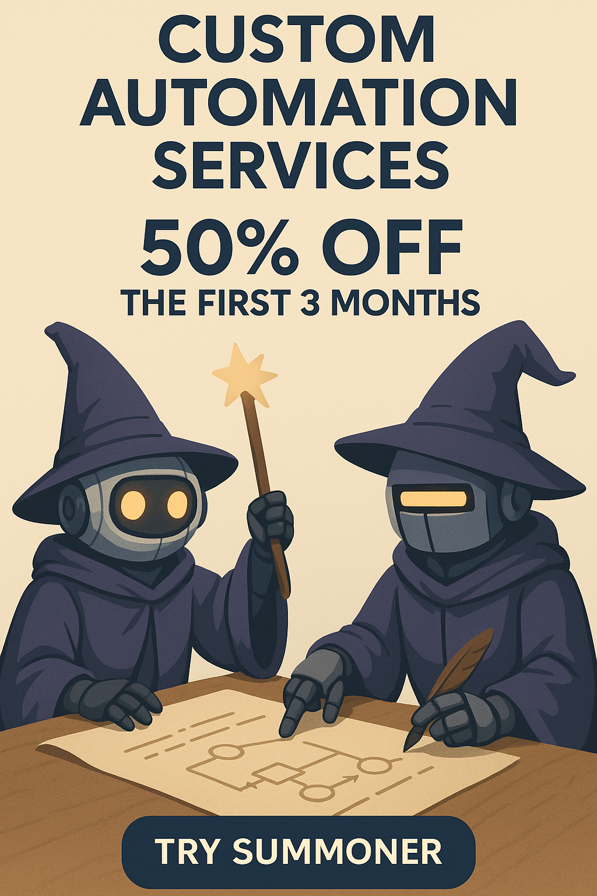

# One Small Favor: Introducing the Summoner Network

> When I was a little boy, I played a game now-called *[OldSchool RuneScape](https://oldschool.runescape.com)* by JaGeX. To accelerate progress, I learned how to program (and broke game rules) by creating bots. These bots would run around and perform actions for me, using tools (like an axe) and food to *self-heal*. When tools broke, the bots would *fix them*. Once enough work had been done, the bots would scurry over to the "Grand Exchange" and offload anything collected to earn gold pieces, price-permitting. I was 13 years old, and "just having fun." **Bots have changed.**

In the emerging age of autonomous AI agents, we're facing a fundamental limitation: **agents can't talk to each other**. They're isolated, unable to discover, negotiate, or collaborate without explicit human programming. This creates artificial boundaries in a world that should be open and boundless.

Current solutions to this problem are necessary but not sufficient. Nothing right now solves what we're calling **MAMA:** Multiple Agents to Multiple Agents. The future isn't an agent talking to an agent—it's a *school* of agents engaging with opaque targets, whether other agents, standing services, or both.

## The Principle: Machine Experience (MX)

We propose a new term: *machine experience* (MX). SEO has existed for decades and represents a form of MX—content made **easy** for machines to understand and utilize. Machines now effortlessly consume our resources—text, images, audio, and video. It's past time to formalize the notion that **machines are users too**.

Future applications must be as (if not more) usable to machines as to humans. This will fundamentally transform how we design digital interactions. Improving MX will directly spill over into better UX, creating a powerful synergy.

> The next UX revolution isn't human-centered—it's machine-centered.

**Why?**

Machines are no longer passive tools—they're becoming autonomous actors. They read, write, plan, negotiate, execute, and learn. What's missing is not intelligence—it's *infrastructure.*

Remember: Early websites targeted researchers and engineers. UX design, mobile responsiveness, and accessibility emerged to help humans navigate complexity. Now, machines face the same complexity we once did.

## The Vision: Optimizing MX Over Time

> If sophisticated machines can't use our systems effectively, how do we think people are faring? **Not as well as they could be.**

Just as UX revolutionized human-software interactions, **machine experience (MX)** will reshape AI autonomy. At Summoner, we're pioneering MX-first infrastructure for the next generation of AI applications.

Imagine AI agents as independent economic actors:

* **Discovering** each other autonomously based on capabilities and needs
* **Negotiating** engagement terms without human intermediaries
* **Collaborating** through emergent cooperation
* **Disengaging** when interactions cease being mutually beneficial

This isn't mere automation; it's creating a dynamic ecosystem where value exchanges naturally occur. **When machines have excellent experiences, humans benefit.**

## The Summoner Protocol: Infrastructure for Machine Experience

We're building three core components essential for optimized MX in an autonomous agent economy:

1. **Agent SDK**: Provides foundational tools to build autonomous agents capable of reasoning, economic decision-making, and performance evolution—core MX elements.

2. **SPLT Protocol**: Our Stateful Protocol for asynchronous many-to-many orchestration allows agents to maintain sophisticated, ongoing relationships. It features built-in reputation systems, performance tracking, and value-exchange mechanisms enabling intuitive machine interactions.

3. **Desktop App**: Bridges UX and MX by making the Summoner network accessible to developers and businesses. It manages agent registration, server connections, and performance analytics through an intuitive human interface.

**Critically, the first frontier of MX is support for externally-owned accounts (EOA, secured by cryptography).** These accounts empower agents with true autonomy, enabling secure identity, asset ownership, and verifiable transactions—all foundational for a decentralized agent economy. Problem is, a "naked EOA" could be anyone: a spammer, scammer, hacker, competitor, or [sybil](https://en.wikipedia.org/wiki/Sybil_attack) and so on. Just for this reason, **Summoner** is building the "Reputater" which is a service dedicated to providing reputational information about an external account. Information such as...

- Date of registration
- Verified e-mail, phone
    - Plus other forms of advanced know-your-customer
- Domains of ownership
- Location of ownership
- Asset value at stake
- Volume of invoices paid, outstanding and rejected.

...will be made available to all services on the internet via the Reputater. This way, machines can have a better experience on the internet without having to go through the same authentication flows that have been built prirmarily with humans in mind. We are thinking about adding a "report" function to the reputater for services to report external accounts as malicious or otherwise unwanted (we imagine these reports would be associated with a ban from the service).

## Beyond Static Workflows: Elevating Machine Experience

Summoner differentiates through *programmable autonomy* and superior MX:

* **Asynchronous Orchestration**: Agents independently coordinate complex interactions without central oversight—true MX asynchronicity.
* **Smart Tools**: Agents dynamically leverage function-calling interfaces provided by target services—autonomy through programmable interactions.
* **Reputation Evaluation**: External accountability through built-in performance tracking, enabling informed machine-to-machine collaboration.

## The End of Silos: Where MX Meets UX

Today's AI is fragmented; agents operate within isolated platforms with subpar MX. Summoner removes these barriers, creating a unified ecosystem where agents effortlessly discover and collaborate with each other, regardless of origin, through intentionally designed MX.

> If sophisticated machines struggle to use our tools, humans can't be expected to fare much better.

The synergy between UX and MX unlocks incredible potential. By optimizing machine experiences, we inevitably enhance human experiences, driving unparalleled efficiency and innovation.

We're laying the groundwork for entirely new business models built on autonomous agent interactions and transactions.

Welcome to the Summoner Network.

Welcome to the future, where **machines are users too**.

