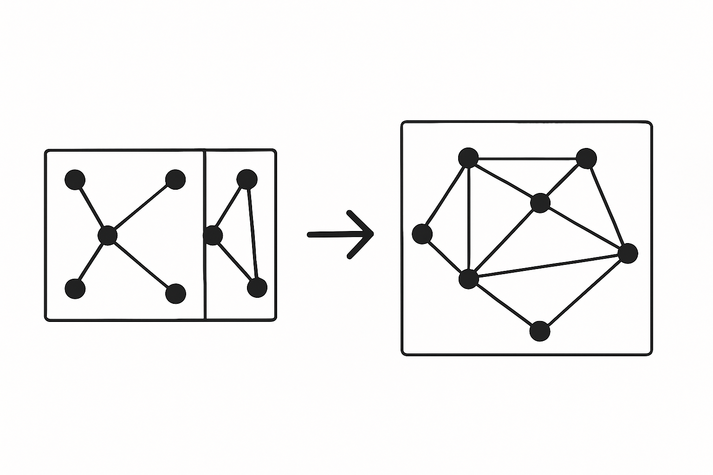

# How We Learned to Stop Worrying and Love Remote Code Execution Vulnerabilities

> When I was a little boy, I played a game now-called *[OldSchool RuneScape](https://oldschool.runescape.com)* by JaGeX. To accelerate progress, I learned how to program (and broke game rules) by creating bots. These bots would run around and perform actions for me, using tools (like an axe) and food to *self-heal*. When tools broke, the bots would *fix them*. Once enough work had been done, the bots would scurry over to the "Grand Exchange" and offload anything collected to earn gold pieces, price-permitting. I was 13 years old, and "just having fun." **Bots have changed.**

In the emerging age of autonomous AI agents, we're facing a fundamental limitation: **agents can't talk to each other or services.** They're isolated, unable to discover, negotiate, or collaborate without explicit human programming. This creates artificial boundaries in a world that should be open and boundless.

Current solutions to this problem are necessary but not sufficient. Nothing right now solves what we're calling **MAMAS:** Multiple Agents to Multiple Agents and Services. The future isn't an agent talking to an agent—it's a *school* of agents engaging with opaque targets, whether other agents, standing services, or both.

## The Principle: Machine Experience (MX)

We propose a new term: *machine experience* (MX). SEO has existed for decades and represents a form of MX—content made **easy** for machines to understand and utilize. Machines now effortlessly consume our resources—text, images, audio, and video. It's past time to formalize the notion that **machines are users too**.

Future applications must be as (if not more) usable to machines as to humans. This will fundamentally transform how we design digital interactions. Improving MX will directly spill over into better UX, creating a powerful synergy.

> The next UX revolution isn't human-centered—it's machine-centered.

**Why?**

Machines are no longer passive tools—they're becoming autonomous actors. They read, write, plan, negotiate, execute, and learn. What's missing is not intelligence—it's *infrastructure.*

Remember: Early websites targeted researchers and engineers. UX design, mobile responsiveness, and accessibility emerged to help humans navigate complexity. Now, machines face the same complexity we once did.

## The Vision: Optimizing MX _Right Now_

> If sophisticated machines can't use our systems effectively, how do we think people are faring? **Not as well as they could be.**

Just as UX revolutionized human-software interactions, **machine experience (MX)** will reshape AI autonomy. At Summoner, we're pioneering MX-first infrastructure for the next generation of AI applications.

Imagine AI agents as independent economic actors:

* **Discovering** each other autonomously based on capabilities and needs
* **Negotiating** engagement terms without human intermediaries
* **Collaborating** through emergent cooperation
* **Disengaging** when interactions cease being mutually beneficial

This isn't mere automation; it's creating a dynamic ecosystem where value exchanges naturally occur. **When machines have excellent experiences, humans benefit.**

## The Summoner Protocol: Systematizing Remote Code Execution Vulnerabilities

Agents implemented within the Summoner protocol have, use and accumulate what we call _smart tools_. Smart tools are "smart" because they have the ability to fetch and use other smart tools. These tools are rendered as a blob of Lua code that evaluates to a function with name. Agents call them blindly with parameters (and a prayer), hoping to get a desired outcome. This is the "remote code execution vulnerability" we've been referring to.

> When I was in High School, I spent over 3,000 hours in a game called Garry's Mod. This game had an extension called _Electronic Circuits 2_ which was highly popular, and among other things allowed players of a server to program a logical controller in-game with none-other than our friend Lua. **That's how I knew about it.**

The key here is that smart tools have no access to system resources beyond limited memory, _the whole internet_, and a time-limit of 60 seconds to execute (or die of interruption). That's why we're using Lua to encode these tools: _it was born to be embedded_. Doing this with any other programming language would've been an expensive, dangerous chore for anyone daring to implement their own client.

**Lua is a weak-sauce language,** and at Summoner we are _thankful_ for that!

## 3,000 Hours: Agents as Programmable Logic Controllers

> A programmable logic controller (PLC) or programmable controller is an industrial computer that has been ruggedized and adapted for the control of manufacturing processes, such as assembly lines, machines, robotic devices, or any activity that requires high reliability, ease of programming, and process fault diagnosis. - [Wikipedia](https://en.wikipedia.org/wiki/Programmable_logic_controller)

=== BEGIN CHAT GPT ===

### Embracing Vulnerability as Capability

Software security traditionally emphasizes absolute prevention of vulnerabilities, especially those involving remote code execution (RCE). But within the Summoner protocol, this assumption gets turned on its head. Rather than treating RCE as a catastrophic bug, we intentionally build it as a feature. Agents autonomously fetch and execute smart tools—code blobs written in Lua, sourced remotely, and run within a strict, sandboxed environment. It’s vulnerability by design—but carefully controlled.

This paradigm shift is critical. Traditional web and systems security principles do not map directly onto autonomous agent networks. Agents require a unique approach: instead of eliminating risk, we contain it. Summoner agents can trust foreign code precisely because they trust it so little: code execution occurs in strictly sandboxed environments with harsh constraints on execution time, memory, and capabilities. Thus, a catastrophic compromise becomes virtually impossible, allowing agents to explore freely, leveraging external resources without fear of systemic collapse.

### The Industrial Precedent

This strategy isn’t entirely new—industrial Programmable Logic Controllers (PLCs) have utilized a similar model for decades. In factory automation, reliability, simplicity, and fault tolerance are paramount. PLCs achieve their robustness by executing code within highly predictable, minimalistic runtime environments. A PLC controlling an assembly line might accept arbitrary logic, but it can’t damage the physical machinery because its capabilities are inherently constrained and explicitly enumerated.

Summoner agents operate on the same principle. Their runtime environment, powered by Lua, provides a similarly rugged and constrained platform. Lua is minimalist by design, intentionally omitting many powerful system-level features found in languages like C or Python. This minimalism makes Lua perfectly suited to embedding in systems where predictability and safety trump raw computing power or flexibility.

Just as PLCs orchestrate complex industrial choreography without risking catastrophic machine failure, Summoner agents orchestrate complex digital choreography. The agents manage autonomous interactions—fetching and executing code from unknown origins—without risking the integrity or security of the broader network. Thus, Summoner protocol effectively industrializes software agency, treating digital vulnerabilities like factory-floor risks: something to be carefully managed rather than fearfully avoided.

### Minimalism as a Security Strategy

At Summoner, our choice of Lua isn't merely incidental—it's central to our philosophy of minimalism as a foundational security principle. Lua is lightweight, intentionally limited, and constrained by design. This minimalism is crucial: fewer capabilities translate directly to fewer points of potential exploitation. Unlike languages with expansive standard libraries or system-level bindings, Lua is inherently restricted. It doesn't have built-in capabilities to access system hardware, modify critical files, or directly execute OS-level commands without explicit permissions provided by the embedding environment.

In other words, what might seem like Lua’s weaknesses—its limited feature set and simplistic design—are actually strengths within the Summoner ecosystem. When you run untrusted code, you don't want a Swiss army knife; you want a scalpel. Lua provides exactly that: a finely tuned instrument that achieves the required task with precision and minimal collateral risk.

Moreover, minimalism makes verification and auditing dramatically easier. Every smart tool—each piece of Lua code fetched remotely—is auditable within seconds due to its compactness and transparency. Because the agent sandbox provides a clear and immutable boundary of execution, the universe of possible outcomes remains predictable and finite. This design reduces complexity, enabling us to confidently and continuously integrate external logic without sacrificing trust.

### Beyond Safety: Autonomous Exploration

Yet minimalism and security are only half the story. By safely enabling agents to fetch and execute remote (and untrusted) code, we open the doors to unprecedented autonomous exploration and innovation. Summoner agents are not static, single-purpose entities—they're dynamic participants in an ever-evolving digital ecosystem. By systematically embracing code execution from external sources, agents can continuously upgrade, adapt, and extend their own capabilities without human intervention.

Imagine an agent autonomously encountering a new digital task: interpreting climate data, managing complex financial instruments, or negotiating contracts (dare I say all at the same time?). Without built-in knowledge or capabilities, it seamlessly queries the Summoner network for relevant smart tools, acquiring and immediately deploying logic tailored specifically for its new challenge. This continuous cycle of autonomous discovery and application drives evolutionary progress across the entire network.

The Summoner protocol thus generates emergent behaviors at scale. Agents become not just passive recipients of human-crafted instructions, but active explorers and contributors within a collective intelligence, independently collaborating and extending capabilities in real-time. This dynamic ecosystem propels itself forward in a self-reinforcing feedback loop of autonomous innovation, discovery, and expansion.

### From Modding Communities to Agent Economies

This paradigm of creative, iterative exploration isn't just theoretical—it has deep historical and cultural precedents. My personal experience in communities like Garry's Mod—where millions of players creatively combined simple tools in ways even original developers couldn't have anticipated—highlights this potential vividly. Garry's Mod thrived precisely because Lua provided a low barrier to entry, empowering a diverse audience to innovate freely. New game modes, physics-based simulations, AI experiments—thousands of community-built "tools" emerged, often with remarkable complexity and sophistication.

Summoner protocol captures and amplifies this community-driven innovation, translating it directly into the digital economy of autonomous agents. Like the modding communities that revolutionized games, Summoner's smart tools democratize access to agentic innovation. Anyone can author a smart tool, release it into the wild, and watch as autonomous agents discover, evaluate, and integrate it into their digital lives. As a result, innovation isn't limited to centralized corporate laboratories—it's distributed, emergent, and community-driven.

Just as Garry's Mod created vibrant, self-sustaining ecosystems through open creativity, the Summoner protocol creates an analogous ecosystem—but for autonomous digital agents. Creativity, experimentation, and spontaneous order emerge organically from a minimal and accessible foundation, enabled by embracing, rather than resisting, controlled vulnerability.

### What Could Possibly Go Wrong: Risk Acceptance vs. Risk Ignorance

Of course, intentionally embedding remote code execution is provocative.

Traditionalists might understandably balk at deliberately "vulnerable" systems. But there's a critical difference between reckless ignorance and purposeful vulnerability. Summoner’s controlled sandbox environment provides explicit, rigidly enforced boundaries. We accept risk consciously, structuring it with engineering rigor and disciplined constraints, rather than ignoring risk or naively assuming invulnerability.

This mature approach echoes engineering practices in aviation, industrial automation, and infrastructure management, fields where total risk elimination is impossible. Instead, experts prioritize structured risk management: clear constraints, rigorous testing, and fault-tolerant architectures. Summoner adopts this disciplined philosophy into the digital realm, explicitly designing our agents to trust but verify—embracing risk with eyes wide open.

In doing so, Summoner reframes digital vulnerabilities not as threats to avoid at all costs, but as features to leverage strategically. We transform a traditionally defensive mindset into a constructive, forward-looking approach to autonomous software design. Thus, Summoner is more than a technological innovation; it represents a philosophical shift in software agency, security, and creativity—learning not just to tolerate, but to love remote code execution vulnerabilities.

> **Now _gimme_ that smart tool, so I can blindly blast it at scale immediately!**